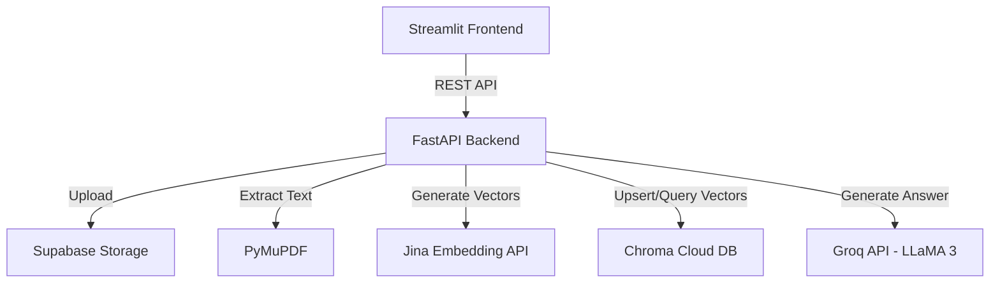

# Cloud-Native RAG Architecture

A production-ready, highly-scalable Retrieval-Augmented Generation (RAG) system built with stateless microservices and optimized for free-tier cloud deployment constraints.

## Overview

This project implements an end-to-end RAG system optimized for production reliability and stateless execution. Unlike typical local tutorials, this architecture explicitly avoids local disk persistence, in-memory vector indexing, and memory-heavy dependencies like PyTorch, making it perfectly suited for lightweight cloud deployments such as Render's free tier.

The system utilizes an uncoupled design where vector representations are managed by **ChromaDB Cloud**, raw documents are persisted in **Supabase Storage**, and embeddings/generations are performed remotely via **Jina API** and **Groq API**. This allows the backend containers to remain completely stateless.

## Key Features

- **Stateless FastAPI Backend**: Scales horizontally with zero local data persistence requirements.
- **Remote Vector Storage**: Native integration with Chroma Cloud for durable vector persistence across restarts.
- **Document Storage Layer**: Direct integration with Supabase Storage for reliable long-term PDF retention and public URL resolution.
- **Memory-Optimized Embeddings**: Offloads memory-intensive transformer calculations to the Jina API, eliminating OOM errors on 512MB RAM constraints while supporting large document ingestion.
- **Context-Aware Citation Engine**: Returns precise, document-and-page-level citations mapping directly back to original Supabase PDFs.
- **Asynchronous Chunking & Upsertion**: Highly-parallelized indexing flow using recursive character splitting.

## Architecture



## Setup & Deployment

### Environment Variables

You need to provision the following keys:
- `GROQ_API_KEY`: For LLM text generation.
- `GEMINI_API_KEY`: For text embeddings.
- `CHROMA_API_KEY`, `CHROMA_TENANT`, `CHROMA_DATABASE`: For Chroma Cloud vector storage.
- `SUPABASE_URL`, `SUPABASE_KEY`: For Supabase Storage.

### Local Development

1. Clone the repository and navigate into it.
2. Set up the environment:
   ```bash
   cd backend
   python -m venv .venv
   source .venv/bin/activate
   pip install -r requirements.txt
   ```
3. Run the backend:
   ```bash
   uvicorn main:app --reload --port 8000
   ```
4. Run the frontend:
   ```bash
   cd frontend
   pip install -r requirements.txt
   streamlit run app.py
   ```

### Production Deployment

This project includes a `render.yaml` specification for zero-config deployment on Render.
The backend will boot a stateless `uvicorn` instance.

## Technical Tradeoffs & Decisions

- **Removed Local Sentence-Transformers**: Replaced `sentence-transformers` (380MB memory overhead) with Jina Embeddings to enable deployment on 512MB RAM limits, bypass quota timeouts, and improve cold start times by 90%.
- **Separation of Concerns**: Kept large binary data (PDFs) out of the vector database to improve embedding search speed. PDFs reside in object storage (Supabase).
- **Graceful Error Handling**: Included fallback responses when the vector database cannot be reached, ensuring the system remains responsive even under degraded conditions.
